# Sincronización de categoría

Para poder trabajar sobre los pacientes y los tratamientos del FMD mediante el sistema online, debemos agrupar estos pacientes en una categoría, y sincronizar dicha categoría a la web. Cada categoría se sincroniza independientemente, es decir, en un mismo FMD puede haber categorías sincronizadas con la web, y categorías con las que se sigue trabajando en local.

## Pasos para sincronizar

Para poder sincronizar una categoría hay que seguir los siguientes pasos:

1. Pulsar en `Categorías` y seleccionar la categoría deseada.

1. Establecer el tipo de categoría a `Web`

	

Los pacientes de esas categorías y sus tratamientos se sincronizarán con el sistema online.

_Se puede repetir este proceso con todas las categorías que sean necesarias. Distintos grupos de pacientes, distintas residencias, ..._

## Acceso a la web

Una vez se haya conectado la categoría a la web, podemos acceder a dicha categoría desde la página web con cualquier usuario de FMD que tenga rol de farmacéutico, o el usuario por defecto de la categoría.

Se puede acceder a la web pulsando el botón "Web" que aparece en la parte superior derecha de la pantalla.

### Inicio sesión

Como se ha indicado, se puede iniciar sesión con el perfil de farmacia o perfil de residencia (o de categoría). El usuario con perfil de farmacia debe introducir el mismo nombre de usuario y contraseña que utiliza en el software FMD. Mientras que el perfil de residencia debe introducir como nombre de usuario y contraseña el mismo nombre de la categoría, en este caso "Categoria Prueba".

Ambos tienen en común que hay que introducir un ID de farmacia, el cual lo encontramos en la pantalla donde anteriormente hemos conectado el FMD a la web.

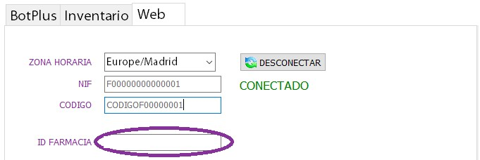

**Primer inicio de sesión**

1. La primera vez que cada usuario inicia sesión, se pide que se firmen los documentos correspondientes.

	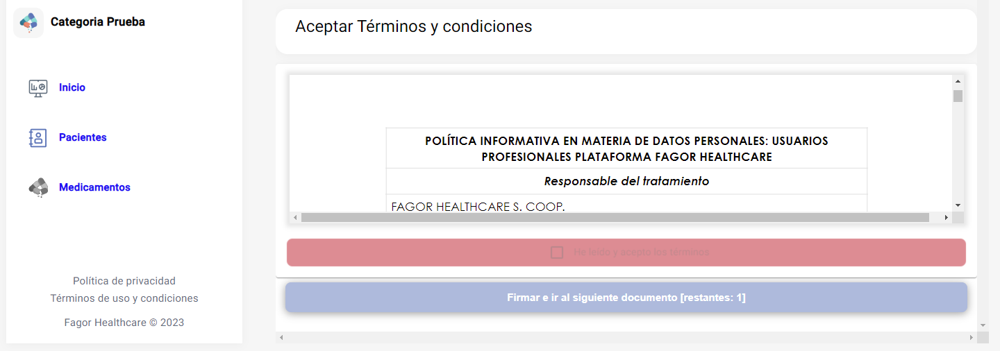

1. Después, se pide restablecer la contraseña inicial, ya que la contraseña del usuario de residencia es la misma que el nombre de la categoría, y la contraseña del usuario de farmacia puede que no cumpla con los requisitos mínimos de seguridad de una contraseña. Para ello se pide rellanar estos datos.

	

1. Se envía un correo con el enlace para restablecer la contraseña a la dirección de correo que se ha especificado anteriormente.

	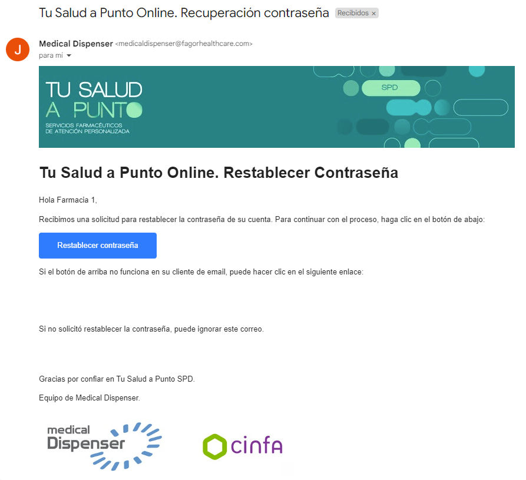

1. Iniciamos sesión con la nueva contraseña y vemos la página principal

	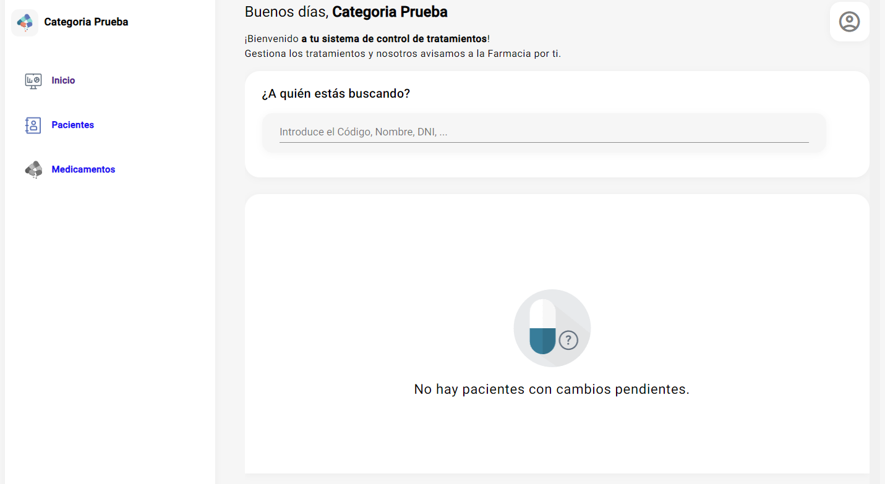

### Tipos de usuarios

Como se ha mencionado anteriormente, hay dos tipos de usuarios, el usuario de farmacia y el usuario de residencia. Ambos tipos acceden a la misma página web con la misma interfaz, pero tienen roles diferentes como se explica a continuación.

**Usuario con perfil de farmacéutico**

El usuario con perfil de farmacia accede a la página web con el mismo usuario y contraseña que en el software FMD. Estas son las características de este usuario:

1. Puede seleccionar entre las diferentes categorías que ha sincronizado la farmacia, y ver todos los pacientes y tratamientos que pertenecen a esas categorías.

	

1. Los cambios que realiza tanto de un paciente como de un tratamiento, se sincronizan al software FMD sin tener que ser validados en el FMD.

1. Como los cambios realizados en el tratamiento entran directamente en el FMD, es obligatorio seleccionar la presentación exacta de un medicamento cuando se vaya a añadir al tratamiento

**Usuario con perfil de residencia**

El usuario con perfil de residencia accede a la página web con el nombre de la categoría como nombre de usuario y contraseña, hasta que restablece la contraseña. Estas son sus características:

1. Solo puede acceder a su propia categoría, es decir, no tiene permiso de acceder a las demás categorías de la farmacia.

1. Los cambios que realiza en los pacientes y los tratamientos quedan pendientes de validar, hasta que se aprueban en el software FMD. Es decir, cuando se hace un cambio, este queda como propuesto, y desde el FMD se puede validar o rechazar el cambio.

1. Al añadir un medicamento nuevo al tratamiento, se puede seleccionar la presentación exacta del medicamento, o sino el grupo homogéneo. Desde la farmacia, cuando se vaya a validar ese cambio, se escoge una presentación de ese grupo homogéneo en base a su criterio.

## Acciones de la web

Estas son las diferentes acciones que se pueden realizar en la página web.

### Inicio

En el apartado de inicio, podemos ver el estado general de la categoría, que consiste en una lista de los pacientes que tienen cambios pendientes de validar por la farmacia, o que han sido rechazados por la farmacia.

### Pacientes

En la pantalla de pacientes, vemos todos los pacientes que pertenecen a la categoría, tanto los que tienen cambios pendientes de validar, como los que están en un estado aceptado.

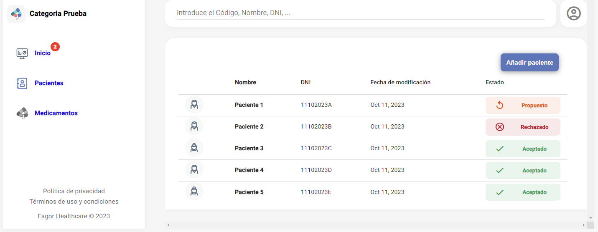

**Añadir paciente**

Estos son los pasos a seguir para añadir un nuevo paciente a la categoría:

1. Pulsar el botón "Añadir paciente" en la pantalla de lista de pacientes.

	

1. Rellenar los datos de la ficha de paciente, y añadir el paciente

	

**Editar, pausar y eliminar paciente**

Para pausar un paciente (no activo en FMD), editar sus campos de la ficha, o eliminar de la categoría, tenemos tres botones en la parte superior derecha de la pantalla del paciente.

#### Tratamientos

**Añadir medicamento al tratamiento**

Estos son los pasos a seguir para añadir un medicamento al tratamiento de un paciente:

1. Pulsar el botón "Añadir tratamiento"

	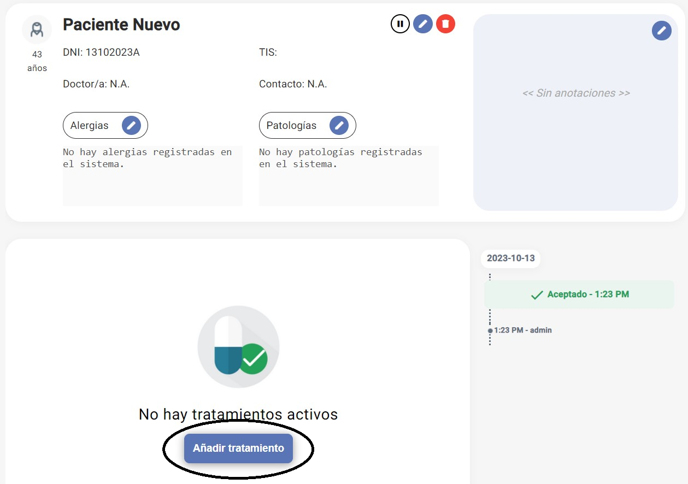

1. Pulsar el botón "Añadir medicamento"

	

1. Seleccionar el medicamento que se quiere añadir, por código nacional o por nombre. En caso de haber iniciado sesión con perfil de residencia, se puede seleccionar el grupo homogéneo

	

1. Rellenar los datos del tratamiento, y seleccionar el tipo de posología

	1. Posología diaria

		Se indica la frecuencia con la que se repiten las tomas, o los días de descanso por cada cierta cantidad de días.

		

	1. Posología semanal

		Se pueden especificar las cantidades para todas las tomas de una semana.

		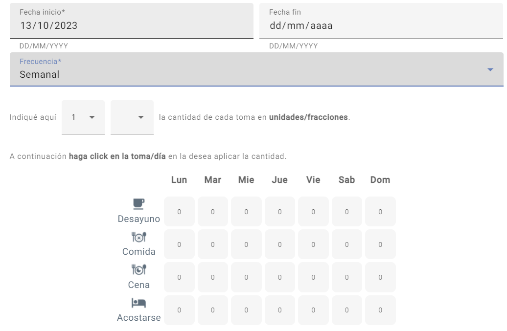

	1. Posología mensual

		Se especifican las tomas para pautas superiores a una semana

		

	1. Otra

		Texto libre para posologías no emblistables

		

1. Por último, hay que enviar la propuesta pulsando el botón rojo "Enviar"

	

1. Cuando se finaliza la propuesta, se puede ver el estado del paciente, en este caso "Pendiente", con los cambios correspondientes

	

**Editar/borrar tratamiento**

Para editar o borrar un medicamento de un tratamiento:

1. Pulsar el botón "Editar" que se encuentra arriba a la derecha del tratamiento

	

1. En el medicamento que se quiere editar o borrar, pulsar el botón correspondiente

	

1. Enviar los cambios realizados con el botón rojo "Enviar"

#### Cambios

En caso de que el cambio propuesto se valide desde FMD, podemos ver el cambio de estado de "Propuesto" a "Aceptado". Sin embargo, si el cambio se rechaza desde FMD, podemos ver el estado "Rechazado" con el mensaje con el que se ha rechazado desde el FMD.

En este caso, se puede editar el tratamiento y enviar la nueva propuesta, o volver a enviar la propuesta anterior con otro mensaje.

**Historial cambios**

Todas las propuestas de cambio, validaciones y rechazos que se hagan, se guardan y se visualizan en la parte derecha del tratamiento. En este apartado se puede ver la acción realizada, el usuario que la ha realizado, el día y la hora, y el mensaje con el que se ha enviado, en caso de haberlo.

### Medicamentos

En la pantalla de medicamentos podemos ver toda la lista de medicamentos que recogemos de la AEMPS, y se actualiza semanalmente. Podemos buscar un medicamento por grupo homogéneo, por nombre de la presentación o código nacional de la presentación, y consultar la ficha del medicamento en caso de querer ver más detalles acerca de este.

## Validación de propuestas desde FMD

Una vez hayamos realizado los cambios correspondientes en la página web, podemos ver esos cambios desde la página web. Podemos ver o darnos cuenta de que hay un cambio mediante estas vías:

1. En cuanto haya un cambio en la página web, en un periodo corto de tiempo, aparecerá un indicador en la parte superior derecha de la pantalla. Si pulsamos el indicador, se nos abre la lista de categorías que contienen cambios pendientes de validar.

	

1. La segunda opción para ver si hay cambios propuestos es abriendo la lista de categorías directamente desde FMD. En esta lista podemos ver las categorías que no están conectadas a la web en gris, las que están conectadas y no tienen cambios pendientes en azul, y las que estásn conectadas y tienen cambios pendientes en rojo.

	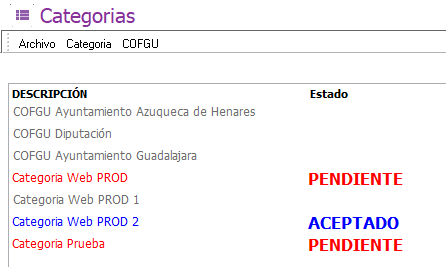

1. Por último, podemos ver si hay cambios propuestos en caso de que vayamos a preparar una carga a un paciente de una categoría conectada, o vayamos a preparar cargas por categoría de una categoría conectada. Si el software deja preparar las cargas sin problemas, quiere decir que no había cambios pendientes de validar. Sin embargo, en caso de haber cambios, el software indica lo siguiente.

	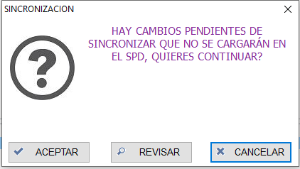

	En este caso, podemos continuar la carga sin validar los cambios (no se cargarían los nuevos cambios en el SPD), o podemos darle al botón de "Revisar" y validar los cambios antes de preparar la carga.

### Pacientes con cambios

Una vez sepamos el estado de cada categoría, podemos ir a revisar los cambios siguiente estos pasos:

1. Seleccionar la categoría que queremos revisar, y en el menú izquierdo de la categoría pulsar el botón "Revisar"

	

1. Veremos la lista de pacientes con cambios propuestos, rechazados o nuevos pacientes

	

1. Seleccionamos un paciente para ver sus cambios, y podemos ver los cambios en la ficha, los cambios en el tratamiento, y el histórico de comentarios o acciones que se han realizado sobre ese paciente.
 
### Consulta de cambios propuestos

Para poder validar los cambios de un paciente, hay que tener en cuenta que se validan todos los cambios a la vez, es decir, no se pueden validar unos cambios y dejar otros sin validar. 

**Ficha de paciente**

En caso de la ficha del paciente, podemos ver en la columna de la izquierda los datos del paciente actual en el FMD (campos vacíos en caso de que sea un nuevo paciente), y los datos nuevos introducidos en la página web, se ven en la columna de la derecha. Si hay algún cambio en uno de los campos, este campo se ve en color azul. En caso de que no haya ningún cambio en la ficha, esta pestáña no se muestra.

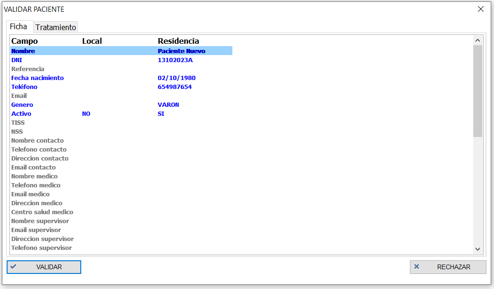 

**Tratamiento**

Si hay algún cambio en el tratamiento, se muestra una pestaña de tratamiento, con todos los medicamentos. En la parte de arriba se muestran los medicamentos nuevos que se han introducido en la página web, los medicamentos que se han editado en la página web, y los medicamentos que se han borrado en la página web. Para ver el cambio que se ha realizado en alguno de los medicamentos, pulsamos sobre el medicamento de arriba, y en la parte inferior vemos el cambio propuesto, ya sea en la posología o en algún otro campo.

 

**Medicamento nuevo**

Los medicamentos nuevos que se han añadido desde la página web, pueden ser de tres tipos:

1. Medicamento con presentación concreta
	Si desde la página web se ha añadido una presentación concreta de un medicamento, este aparece con un fondo sin color en el FMD, y se puede validar sin problemas

1. Medicamento con presentación concreta, sin definir en el FMD
	En caso de que se trate de una presentación que no lo tenemos definido en el FMD, el medicamento aparece con el fondo de color amarillo. En ese caso, tenemos que hacer doble click en el medicamento, y definir las propiedades del medicamento.

1. Grupo homogéneo
	En caso de que desde la página web se haya especificado un grupo homogéneo y no una presentación, vemos que el código nacional y la descripción del medicamento están vacías, y el color de fondo es naranja. Tenemos que hacer doble click, y especificar la presentación exacta de ese grupo homogéneo.

	 
	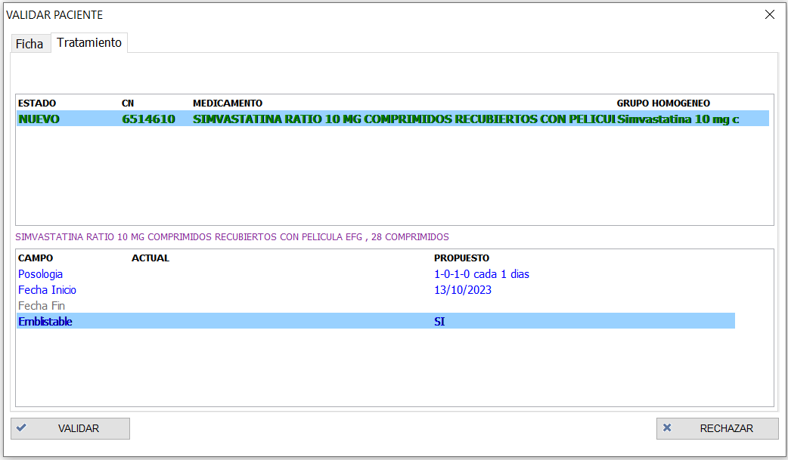 

**Comentarios**

En la última pestaña de comentarios podemos ver el historial de comentarios y cambios que se han realizado sobre ese paciente, los nombres de los usuarios que lo han realizado, y la fecha en la que se ha realizado.

 

### Validar/rechazar los cambios

Una vez hayamos definido los nuevos medicamentos, en caso de haberlos, podemos validar o rechazar los cambios. Si se validan los cambios, estos se modifican en el software FMD, y se podrían ver en las pantallas de ficha o tratamiento del paciente. En caso de querer rechazar los cambios, se pulsa el botón "Rechazar", y escribimos el comentario con el que queremos enviar el rechazo.

 

