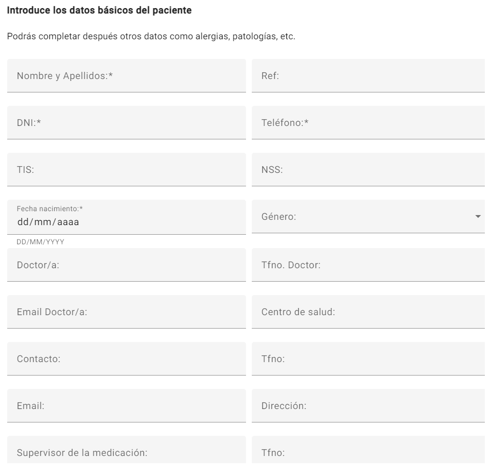
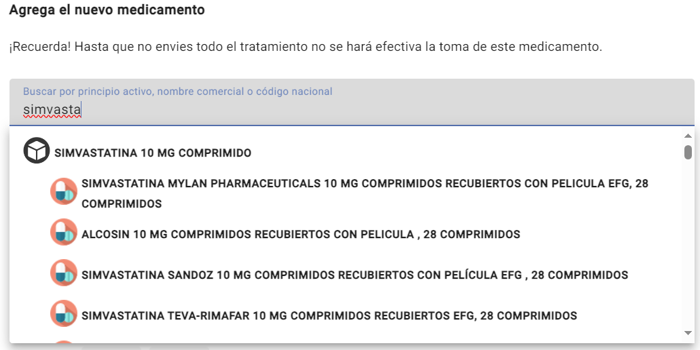
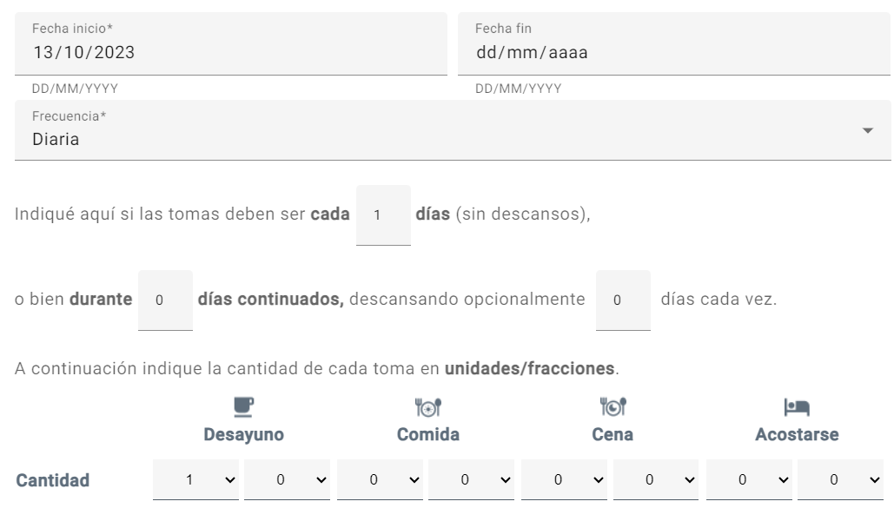
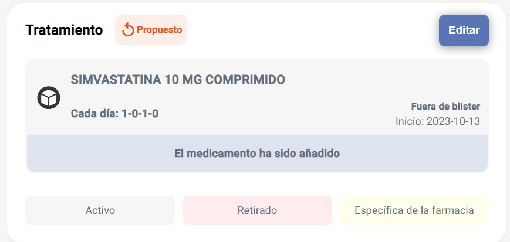
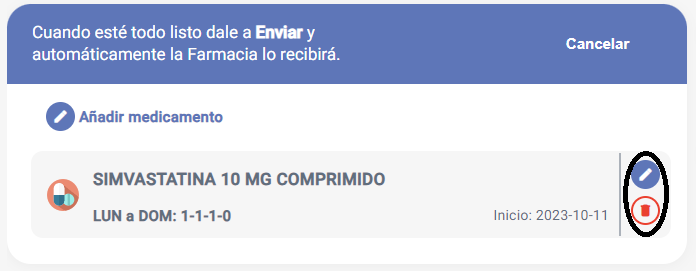
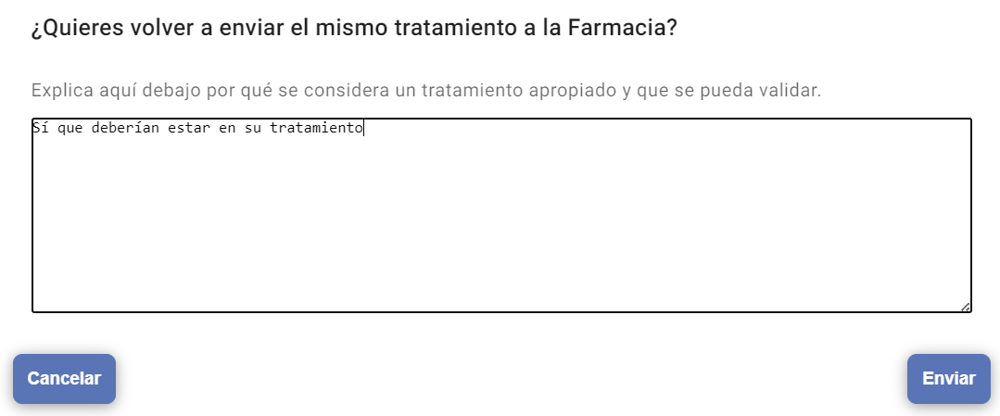

# Gestión de pacientes y tratamientos

Una vez hayamos sincronizado la categoría a la web, podemos empezar a trabajar sobre ella, modificando información de pacientes y sus tratamientos.

## Pacientes

### Añadir paciente

Estos son los pasos a seguir para añadir un nuevo paciente a la categoría:

1. Pulsar el botón "Añadir paciente" en la pantalla de lista de pacientes.

	

1. Rellenar los datos de la ficha de paciente, y añadir el paciente

	

### Editar, pausar y eliminar paciente

Para pausar un paciente (no activo en FMD), editar sus campos de la ficha, o eliminar de la categoría, tenemos tres botones en la parte superior derecha de la pantalla del paciente.

## Tratamientos

### Añadir medicamento al tratamiento

Estos son los pasos a seguir para añadir un medicamento al tratamiento de un paciente:

1. Pulsar el botón "Añadir tratamiento"

	

1. Pulsar el botón "Añadir medicamento"

	

1. Seleccionar el medicamento que se quiere añadir, por código nacional o por nombre. En caso de haber iniciado sesión con perfil de residencia, se puede seleccionar el grupo homogéneo

	

1. Rellenar los datos del tratamiento, y seleccionar el tipo de posología

	1. Posología diaria

		Se indica la frecuencia con la que se repiten las tomas, o los días de descanso por cada cierta cantidad de días.

		

	1. Posología semanal

		Se pueden especificar las cantidades para todas las tomas de una semana.

		

	1. Posología mensual

		Se especifican las tomas para pautas superiores a una semana

		

	1. Otra

		Texto libre para posologías no emblistables

		

1. Por último, hay que enviar la propuesta pulsando el botón rojo "Enviar"

	

1. Cuando se finaliza la propuesta, se puede ver el estado del paciente, en este caso "Pendiente", con los cambios correspondientes

	

### Editar/borrar tratamiento

Para editar o borrar un medicamento de un tratamiento:

1. Pulsar el botón "Editar" que se encuentra arriba a la derecha del tratamiento

	

1. En el medicamento que se quiere editar o borrar, pulsar el botón correspondiente

	

1. Enviar los cambios realizados con el botón rojo "Enviar"

## Cambios rechazados

En caso de que el cambio propuesto se valide desde FMD, podemos ver el cambio de estado de "Propuesto" a "Aceptado". Sin embargo, si el cambio se rechaza desde FMD, podemos ver el estado "Rechazado" con el mensaje con el que se ha rechazado desde el FMD.

En este caso, se puede editar el tratamiento y enviar la nueva propuesta, o volver a enviar la propuesta anterior con otro mensaje.

## Historial cambios

Todas las propuestas de cambio, validaciones y rechazos que se hagan, se guardan y se visualizan en la parte derecha del tratamiento. En este apartado se puede ver la acción realizada, el usuario que la ha realizado, el día y la hora, y el mensaje con el que se ha enviado, en caso de haberlo.

